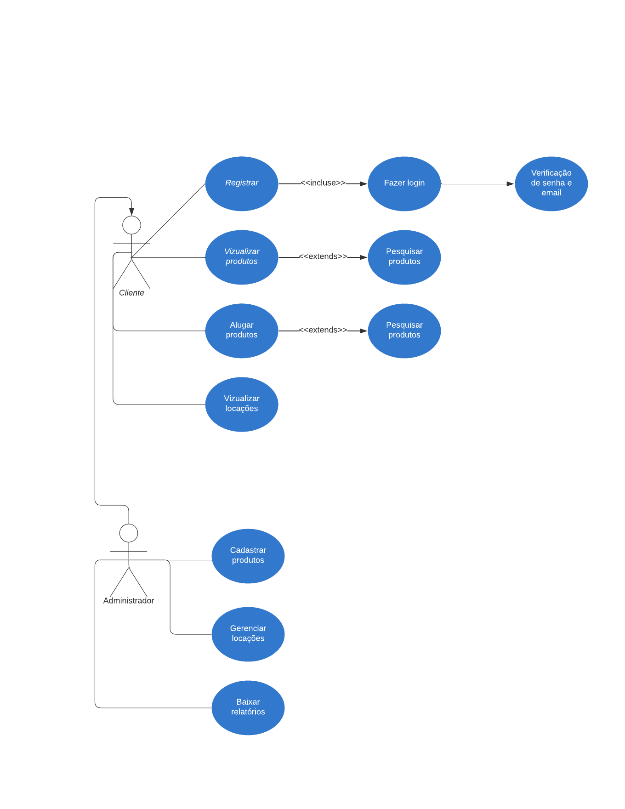

# Especificações do Projeto

## Personas

Personas são como personagens fictícios que representam grupos de usuários reais. Elas ajudam os desenvolvedores a entender quem usará o sistema, quais são suas necessidades e como criar uma experiência que atenda a essas expectativas. Ao criar personas, os desenvolvedores podem projetar um sistema mais amigável, eficiente e personalizado, garantindo que atenda às reais necessidades e preferências dos usuários finais.

| Nome   | Idade | Ocupação   | Aplicativos | Hobbies  | Motivações                           | Frustrações                                          |
| ------ | ----- | ---------- | ----------- | -------- | ------------------------------------ | ---------------------------------------------------- |
| João   | 25    | Estudante  | Instagram   | Esportes | Facilidade de uso, Praticidade       | Lentidão em processos, Interfaces complexas          |
| Maria  | 30    | Professora | WhatsApp    | Leitura  | Comunicação eficaz, Organização      | Falta de tempo, Dificuldades tecnológicas            |
| Carlos | 35    | Empresário | LinkedIn    | Esportes | Networking, Crescimento profissional | Falta de atualização das conexões, Interface confusa |

## Histórias de Usuários

Histórias de usuários, frequentemente usadas em metodologias ágeis de desenvolvimento de software, são descrições curtas e centradas no usuário das funcionalidades desejadas de um sistema. Cada história de usuário descreve uma necessidade específica do ponto de vista do usuário e geralmente segue o formato "Como [tipo de usuário], gostaria de [realizar algo] para [atingir um objetivo]".

| Eu como ... `Persona` | Quero/Preciso ... `Funcionalidade`          | Para ... `Motivo/Valor`                                   |
| --------------------- | ------------------------------------------- | --------------------------------------------------------- |
| João                  | Pesquisar produtos disponíveis para locação | Encontrar rapidamente o que desejo alugar                 |
| Maria                 | Visualizar histórico de locações            | Ter um controle sobre os produtos que já aluguei          |
| Carlos                | Cadastrar novos produtos para locação       | Adicionar facilmente novos itens disponíveis para aluguel |

## Requisitos

Requisitos são especificações detalhadas que definem o que um sistema de software deve realizar. Eles servem como a base para o projeto e desenvolvimento de uma aplicação, garantindo que o resultado final atenda às necessidades dos usuários e aos objetivos do projeto.

### Requisitos Funcionais

Requisitos funcionais descrevem as funcionalidades específicas que o sistema deve oferecer, como ações, processos e interações com o usuário. Por exemplo, requisitos funcionais podem incluir a capacidade de criar uma conta de usuário, fazer login, adicionar produtos ao carrinho de compras e concluir uma compra.

| ID   | Descrição do Requisito                                                        | Prioridade |
| ---- | ----------------------------------------------------------------------------- | ---------- |
| RF01 | Sistema deve permitir a pesquisa de produtos disponíveis para locação         | Alta       |
| RF02 | Sistema deve exibir detalhes dos produtos, incluindo preço e disponibilidade  | Média      |
| RF03 | Usuário administrador deve poder cadastrar novos produtos para locação        | Alta       |
| RF04 | Usuário administrador deve poder registrar a retirada e devolução de produtos | Alta       |
| RF05 | Sistema deve manter histórico de locações para cada cliente                   | Média      |
| RF06 | Cliente deve poder visualizar seu histórico de locações                       | Alta       |
| RF07 | Sistema deve permitir autenticação via e-mail/senha                           | Média      |

## Requisitos Não Funcionais

Requisitos não funcionais, por outro lado, abordam características que não se relacionam diretamente com funcionalidades, mas afetam a qualidade do sistema, como desempenho, segurança, usabilidade e escalabilidade. Isso pode incluir a velocidade de carregamento das páginas, a capacidade de lidar com um grande número de usuários simultâneos ou a conformidade com regulamentações de segurança de dados.

| ID    | Descrição do Requisito                                                    | Prioridade |
| ----- | ------------------------------------------------------------------------- | ---------- |
| RNF01 | A aplicação deve ser desenvolvida utilizando C#                           | Alta       |
| RNF02 | A interface do usuário deve ser intuitiva e de fácil utilização           | Média      |
| RNF03 | A aplicação deve ser responsiva para diferentes dispositivos              | Baixa      |
| RNF04 | A aplicação deve ter um tempo de resposta aceitável em todas as operações | Alta       |

## Restrições

| ID  | Restrição                                             |
| --- | ----------------------------------------------------- |
| R01 | O projeto deverá ser entregue até o final do semestre |
| R02 | Pagamentos serão realizados fora da aplicação         |

## Diagrama de Casos de Uso

