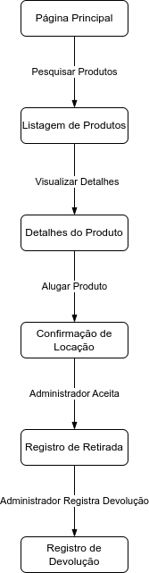

# Projeto de Interface

> Pré-requisitos: [Especificação do Projeto](02-especificacao-do-projeto.md)

## Diagrama de Fluxo

## Wireframes

Os Wireframes se encontram [nesse arquivo](img/wireframes-interativos.pdf).

> Para utilizá-los de forma interativa, baixe o arquivo localmente e abra-o no navegador (Chrome, Edge, Mozila).
