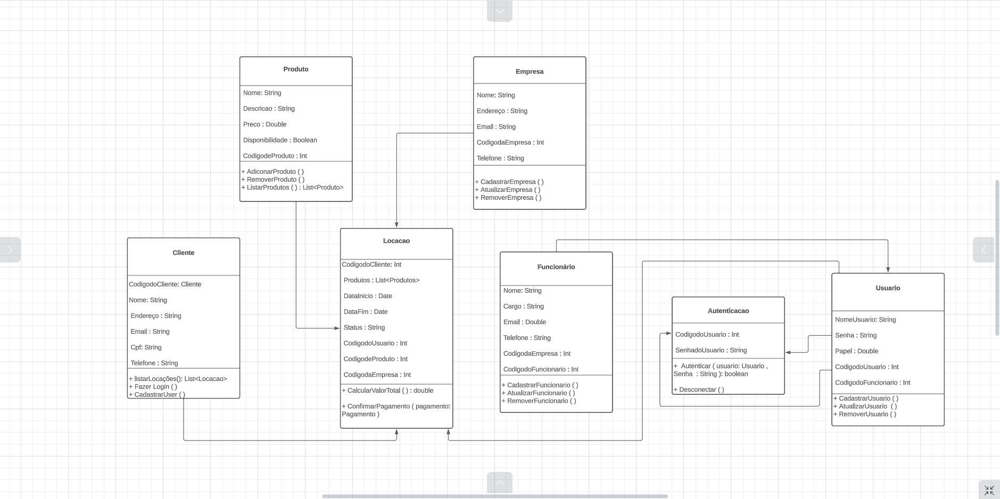
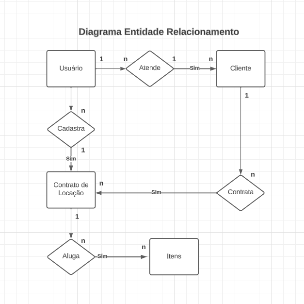
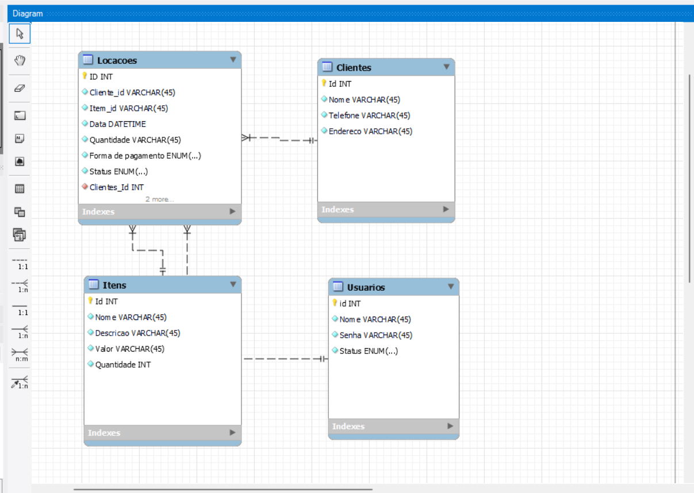

# Arquitetura da Solução

> Pré-requisitos: [Projeto de Interface](04-projeto-de-interface.md)

## Diagrama de Classes

## Modelo ER (Projeto Conceitual)

## Projeto da Base de Dados

## Tecnologias Utilizadas

- Linguagem: C#
- Framework: ASP.NET 7.0 (Web application)
- Gerador de páginas: Razor Pages
- ORM: Entity Framework
- SGBD: A definir
- IDEs: Visual Studio Code

> **Orientações dos professores**: Apresente também uma figura explicando como as tecnologias estão relacionadas ou como uma interação do usuário com o sistema vai ser conduzida, por onde ela passa até retornar uma resposta ao usuário.

## Hospedagem

> **Orientações dos professores**: Explique como a hospedagem e o lançamento da plataforma foi feita.
