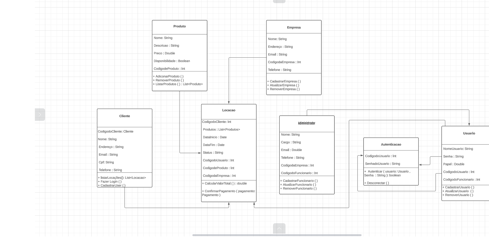

# Arquitetura da Solução

> Pré-requisitos: [Projeto de Interface](04-projeto-de-interface.md)

## Diagrama de Classes

## Modelo ER (Projeto Conceitual)

> **Orientações dos professores**: O Modelo ER representa através de um diagrama como as entidades (coisas, objetos) se relacionam entre si na aplicação interativa.
>
> Sugestão de ferramentas para geração deste artefato: LucidChart e Draw.io.
>
> A referência abaixo irá auxiliá-lo na geração do artefato “Modelo ER”.

## Projeto da Base de Dados

Este projeto de base de dados tem como objetivo criar a estrutura de armazenamento de informações essencial para a aplicação de gestão de locação de produtos. A base de dados será projetada para acomodar informações detalhadas sobre clientes, itens disponíveis para locação e registros de locações, incluindo dados como nome, descrição, valor, status e outros atributos relevantes. A estrutura de banco de dados será desenvolvida para garantir eficiência, escalabilidade e integridade dos dados, permitindo que a aplicação gerencie as operações de locação de forma eficaz e segura
Consideraremos a criação das seguintes tabelas:

1. Tabela "Clientes":
   - `ID` (Chave Primária)
   - `Nome`
   - `Endereço`
   - `Telefone`

2. Tabela "Itens":
   - `ID` (Chave Primária)
   - `Nome`
   - `Descrição`
   - `Valor`

3. Tabela "Locações":
   - `ID` (Chave Primária)
   - `Cliente_ID` (Chave Estrangeira referenciando a tabela "Clientes")
   - `Item_ID` (Chave Estrangeira referenciando a tabela "Itens")
   - `Data`
   - `Descrição`
   - `Quantidade`
   - `Forma_de_Pagamento`
   - `Status` (Valores possíveis: Agendado, Confirmado, Pago, Cancelado)
4. Usuarios
   - `ID` (Chave Primária)
   - `Nome` 
   - `Status` 
   - `Senha` 

Relacionamentos:
- Um cliente pode ter várias locações, mas cada locação pertence a um único cliente.
- Um item pode estar presente em várias locações, mas cada locação inclui um único item.

## Tecnologias Utilizadas

- Linguagem: C#
- Framework: ASP.NET 7.0 (Web application)
- Gerador de páginas: Razor Pages
- ORM: Entity Framework
- SGBD: A definir
- IDEs: Visual Studio Code

> **Orientações dos professores**: Apresente também uma figura explicando como as tecnologias estão relacionadas ou como uma interação do usuário com o sistema vai ser conduzida, por onde ela passa até retornar uma resposta ao usuário.

## Hospedagem

> **Orientações dos professores**: Explique como a hospedagem e o lançamento da plataforma foi feita.
